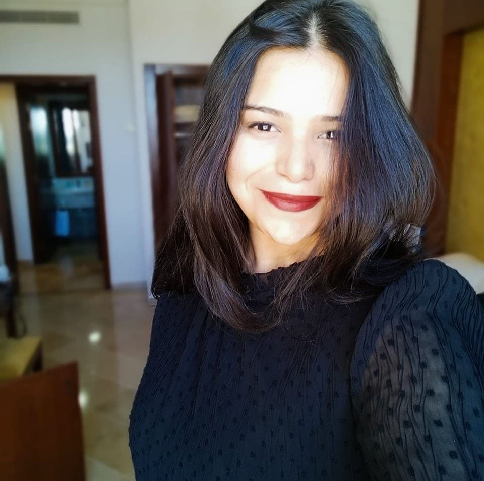

# 🌟 Arij Zahra Soula – Portfolio

📄 [Download my CV](Portfolio/ZahraSoula_Resume.pdf)  

---

## 👩‍🎓 About Me
I am **Arij Zahra Soula**, a Computer Science Engineering graduate specialized in **Data Science**.  
I have experience in **NLP, speech technologies, recommendation systems, healthcare AI, and applied ML/DL**. My research focuses on **semantic code clone detection**, **vector databases**, and **scalable AI pipelines**.  

I am passionate about contributing to **AI research** across multiple domains, particularly at the intersection of **software engineering, natural language processing, and scalable machine learning systems**.  

**Languages:** English (Fluent), French (Fluent), Arabic (Native)  
**Location:** Tunisia  

---

## 🎓 Education

- **Higher School of Engineering and Technology of Tunisia (ESPRIT)**  
  *Computer Science Engineering – Data Science Specialization* | **Sep 2021 – June 2025** | GPA: 3.5  
  Relevant courses: Machine Learning, Deep Learning, Big Data, Mathematics  

- **Institute of Preparatory Engineering Studies of Tunis (IPEIT)**  
  *Preparatory Studies in Engineering* | **Sep 2019 – Aug 2021**  

- **Bourguiba Pioneer High School of Tunis (LPBT)**  
  *Baccalauréat in Experimental Sciences* | **Sep 2015 – June 2019**  

---

## 💼 Research & Professional Experience

### **AI Researcher Intern – Polytechnique Montréal, Canada**  
**May 2024 – Dec 2024**  
Research-focused project on detecting semantic code clones (Type-4) using NLP, embeddings, and vector databases.

Contributions:

-Data Preparation & Cleaning: Processed large-scale datasets (POJ104, BigCloneBench, Google Code Jam, CodeNet) to extract and normalize code functions.

-Pipeline Development: Built a data ingestion pipeline capable of handling millions of code samples with batch processing for scalability.

-Embeddings Generation: Leveraged Sentence Transformers to generate high-dimensional vector representations of source code.

-Vector Database Integration: Designed and implemented similarity search with Qdrant, including collection setup, batching, and query optimization.

-Evaluation & Experiments: Compared the performance of vector database approaches vs. deep learning models (accuracy, recall, scalability).

Performance Optimization: Addressed challenges like vector dimension mismatches, memory bottlenecks, and computational efficiency.

-Semantic Clone Detection: Focused on cross-language clone detection, going beyond syntactic similarity to capture deeper semantic relationships.

-Research Contribution: Defined research questions around effectiveness, performance, and scalability of embedding-based approaches, providing insights for future academic publications.

💡 Impact: Showcased how vector database–based methods can serve as a lightweight, scalable alternative to neural network approaches for clone detection, paving the way for integration into developer tools and IDEs
  - [Engineering graduation thesis](Portfolio/CCD_Zahra_Report.pdf)  

---

### **AI Engineer Intern – IVA AI Startup, Tallinn, Estonia**  
**July 2023 – Sep 2023**  
Industry-focused internship applying speech technologies to enhance customer experience through text-to-speech (TTS) and speech-to-text (STT) systems.

Contributions:

Model Development: Implemented state-of-the-art TTS and STT models to improve speech synthesis and transcription.

Fine-Tuning & Training: Optimized TTS models for natural-sounding speech output and STT models for high transcription accuracy.

Pipeline Integration: Designed an end-to-end pipeline for call transcript conversion, integrating data preprocessing, model inference, and storage.

Cloud Deployment: Leveraged Microsoft Azure services for scalable model deployment and monitoring.

Performance Optimization: Improved conversion speed and accuracy for real-time call handling scenarios.

Data Accessibility: Enabled structured data extraction from audio calls, making insights available for downstream analytics.

Research Application: Applied transformer-based NLP models (BERT, Transformers) and libraries like NLTK to enhance model robustness.

💡 Impact: Increased accuracy and efficiency of call transcription, improving customer experience and enabling organizations to leverage voice data more effectively for analysis and decision-making.

---

### **Data Engineer Intern – ESPRIT School of Engineering, Tunisia**  
**June 2023 – Sep 2023**  

Worked on building a small-scale data pipeline to help the university analyze student performance and attendance trends. Focused on collecting, cleaning, and structuring data from existing sources for reporting purposes.

Key Contributions:

-Data Extraction: Collected student grades, attendance, and course info from Excel files and Moodle exports.

-Data Cleaning & Transformation: Used Python (Pandas) to handle missing values, normalize formats, and merge datasets.

-Database Setup: Created a simple PostgreSQL database to store processed data for easy querying.

-Basic Analytics: Generated summary statistics (average grades, attendance rates) to identify trends and patterns.

-Reporting: Built basic visualizations with Matplotlib / Power BI to support faculty understanding of student performance.

💡Impact:
Helped the faculty quickly identify students at risk, track course performance trends, and make informed decisions, while gaining hands-on experience in data engineering fundamentals and ETL workflows

---

## 🚀 Projects

- **🔎 Risk Management Conceptual Graph-Based Recommendation System**  
  - Built a system to extract insights from textual data and support risk management.  
  - Applied **NLP + Graph Neural Networks (GNNs)** for recommendations.  
  - [GitHub Repo](https://github.com/Arijaa/Risk-management-conceptual-graph-project.git)  

- **⚙️ Student Job Market DevOps Project**  
  - Set up **Jenkins pipelines**, automated testing, and monitoring with **Grafana + Prometheus**.  
  - Used DockerHub and SonarQube for CI/CD and code quality assurance.  

- **🤖 MindMatch: Career Center Platform (NLP Project)**  
  - Built a **job recommendation system** and chatbot using LinkedIn/Job data.  
  - Tools: Python, PyTorch, Scikit-learn, Power BI  
  - [GitHub Repo](https://github.com/Arijaa/MindMatch.git)  

- **🧬 Chronic Kidney Disease Classification (ML Project)**  
  - Applied KNN, SVM, Random Forest, and XGBoost to improve prediction accuracy.  
  - [GitHub Repo](https://github.com/Arijaa/Chronic-Kidney-disease-clustring-and-prediction.git)  

---

## 🛠️ Technical Skills

- **Programming:** Python, R, SQL  
- **AI/ML/DL:** CNN, RNN, LSTM, Transformers, RAG, XGBoost  
- **NLP & Speech:** Sentence Transformers, SpaCy, Embeddings, Retrieval pipelines, TTS, STT  
- **Frameworks:** TensorFlow, PyTorch, Scikit-learn, Pandas  
- **Databases:** PostgreSQL, MongoDB  
- **Other Tools:** Docker, Jenkins, Power BI, Git  

---

## 🏆 Certifications & Achievements
- 🥈 **Second Place** – TICAD 8 Automotive AI Challenge Hackathon  
- 🎓 **NVIDIA** – Applications of AI for Anomaly Detection (Certificate)  
- 🎓 **Deeplearning.AI** – Natural Language Processing Specialization  

---

## 🌍 Leadership & Extracurriculars

- **IEEE Tunisia Section Student Representative (2023–2024)**  
  Represented Tunisia at **national and international conferences**, highlighting section activities and leading student meetings.  

- **Founder & Chairperson – IEEE Computational Intelligence Society (2022–2023)**  
  Founded and led the **first student branch chapter in Tunisia**, organizing workshops and an AI Hackathon.  

---

## 🔬 Research Interests
- **AI for Software Engineering:** Code analysis, semantic clone detection, program understanding  
- **Natural Language Processing:** Multilingual embeddings, low-resource languages, speech-to-text  
- **Scalable AI Systems:** Vector databases, embedding pipelines, efficient ML infrastructure  
- **Applied AI:** Healthcare AI, recommendation systems, risk management  

---

## 📫 Contact
- 📧 Email: [arijzahra.soula@gmail.com](mailto:arijzahra.soula@gmail.com)  
- 🔗 LinkedIn: [linkedin.com/in/arijzahrasoula](https://www.linkedin.com/in/arij-zahra-soula-baa1b5216/)  
- 💻 GitHub: [github.com/Arijaa](https://github.com/Arijaa)  
- 🌐 Portfolio: [arijsoula.github.io](https://arijsoula.github.io)  
- 📄 [Download my CV](Portfolio/ZahraSoula_Resume.pdf)  

---
  

